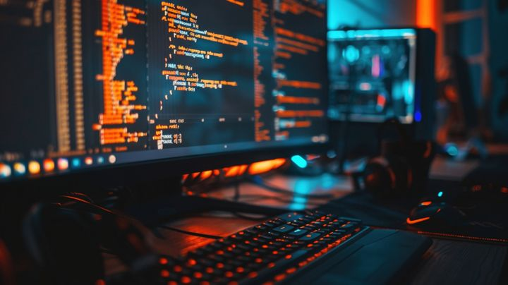

  

<h2 align="center">
  
</h2>
## 🧑‍💻 About Me

* 🎓 Final Year BTech CSE Student
* 💻 Passionate about Web Development
* 🚀 Built projects using **React, Node.js, and modern web technologies**
* 🛠️ Experienced in developing full-stack applications

---

## 🛠️ Tech Stack

* 💻 **Languages:** HTML, CSS, JavaScript
* ⚙️ **Frameworks & Libraries:** MERN Stack (MongoDB, Express.js, React, Node.js)
* 🤖 **AI Integration:** OpenAI / Image Generation APIs
* 🗄️ **Databases:** MongoDB, SQL
* 🛠️ **Tools & IDE:** VS Code, Git, GitHub

---

## 🚀 Projects

* 🎨 **AI Thumbnail Generator (MERN)**
  A web application that generates high-quality thumbnails using AI

* 🏨 **Hotel Booking Website**
  Full-stack booking system with authentication

* 🍔 **Food Delivery Web App**
  Online platform with cart, checkout, and order tracking

---

## 📊 GitHub Stats

  

  

---

## 🌐 Connect with me

* Email: your-email
* LinkedIn: your-link
